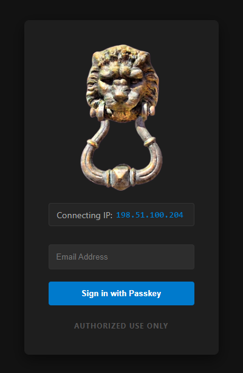
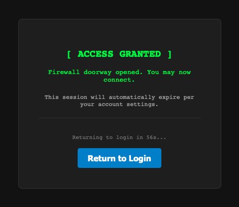
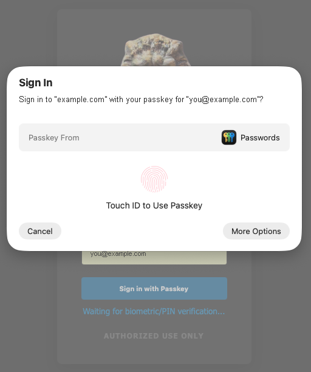

<div align="center">
  
  <h1>MFA Firewall Knocker</h1>
  <p><strong>Open a firewall port for your IP — but only after real multi-factor authentication.</strong></p>
</div>

---

Exposing SSH, RDP, or any admin port to the internet means exposing it to everyone. Closing it means
you can't reach it either. This is the middle path: the port stays **closed by default**, and a
user who proves who they are with a passkey gets a firewall rule opened **for their
source IP only**, which **expires automatically**.

It's port knocking, except the knock is WebAuthn instead of a magic packet sequence.

<div align="center">
  
  <p><em>The page tells you which IP it is about to open, before you authenticate.</em></p>
</div>

## Why this exists

SSH and WireGuard authenticate a *key*. Neither can answer the question that actually matters:

> **Is the authorized user the one using this key, right now?**

Possession is the whole test. A copied WireGuard profile or a leaked `id_ed25519` passes it
forever, from anywhere, and the protocol has no way to notice — which is why detecting key
theft after the fact tends to be guesswork.

This project answers that question *before the protocol ever sees a packet*. The port is
closed by default; it opens only for the source IP of someone who just proved who they are
with a phishing-resistant credential — a passkey, requiring their enrolled device and their
biometric or PIN. A stolen key alone can no longer reach the service that would accept it.
The grant expires on its own, and every one is logged: who, from where, when.

It sits *in front of* SSH, WireGuard, RDP, or anything else guarded by a port, without replacing
them or asking you to migrate anything. WireGuard was the original reason this exists — if that's
your use case, [WIREGUARD.md](WIREGUARD.md) covers the parts specific to it: config, what happens
to a session in progress when a grant expires, and how roaming interacts with a per-IP gate.

### It is often a requirement, not just a good idea

Multi-factor authentication for remote network access is a control that turns up wherever someone
is checking: cyber-insurance questionnaires, NIST SP 800-171 (3.5.3) and therefore CMMC, PCI-DSS,
and most SOC 2 programs.

**A WireGuard profile or an SSH key does not satisfy it.** It is a single factor — *something you
have* — and possession of the file is the entire test. Putting a passkey in front of the port adds
a genuinely independent second factor: the enrolled device, plus the user's biometric or PIN,
verified at the moment of access rather than once at enrolment.

Whether that satisfies your particular auditor, carrier or program is a question only they can
answer, and this project makes no compliance claim on your behalf. But if you have been asked
whether remote access to your network sits behind MFA, and the answer was "not really",
this is a direct way to change that without replacing the VPN you already run.

### How this differs from Tailscale and friends

Products like Tailscale, Twingate and Cloudflare Access address the same underlying problem, and
they are mature, well-built things. **This is not a drop-in replacement for any of them** — it is
a different way of binding a key to a person, with genuinely different trade-offs.

They bind the key **at enrolment**. The device generates its own key, the key never leaves it,
and SSO ties it to a real identity, so the credential is non-transferable by construction. Then
they build a network on top: mesh routing, NAT traversal, DNS, ACLs, exit nodes. The binding
holds until the key expires or you revoke it centrally.

This binds the key **at time of use**. It never touches your SSH or WireGuard keys at all. It
makes the port unreachable until a human proves who they are — right now, with a
phishing-resistant credential — and then opens it narrowly and briefly.

| | Overlay products | This |
|---|---|---|
| Binds key to human | at enrolment | at each use |
| Builds a network | yes — mesh, NAT traversal, DNS, routing | no |
| Client agent | required | none; any browser with a passkey |
| Third party in the trust path | yes | none |
| Existing keys and topology | replaced or absorbed | untouched |
| Re-proof of the human | at enrolment, then on key expiry | every session |
| Identity/ACL platform | SSO, SCIM, device posture, ACL language | none |

The deeper difference is philosophical, not just featural. **This is deliberately small** — closer
in spirit to WireGuard than to a platform. The entire mechanism fits in a sentence: prove you are
a human with a passkey, a firewall rule appears for your IP, it expires. You can verify the whole
thing with `iptables -S`. There is no control plane, no coordination server, no agent, no overlay;
the state you have to reason about is a firewall rule and a user file. One person can read the
source end to end in an afternoon.

That is the same bet WireGuard made — be small enough to audit rather than large enough to cover
everything. It is why TOTP is compiled out rather than config-disabled, and why the built-in ACME
client was deleted rather than repaired: a capability that isn't there cannot be misconfigured,
and cannot hide a bug.

Tailscale is an enterprise system, and that is not a criticism. Fleet management, SSO/SCIM,
device posture, an ACL language and audit tooling are what organisations genuinely need at scale,
and you cannot deliver them in something a single person reads in an afternoon. The moving parts
are the point.

The flip side is just as real: small means it does less. If you need those capabilities, "you can
read the whole thing" is not a substitute for having them.

Pick accordingly. **If you need a network** — reaching things behind NAT, routing subnets,
naming hosts — those products build one and this does not. **If what you have already works and
you only want a human gate in front of it**, this adds one without a third party, an agent, or a
migration.

Its own weaknesses are worth stating plainly: per-IP gating degrades behind CGNAT, corporate
VPNs, and iCloud Private Relay, where a user authenticates from one address and connects from
another; once a rule is open it is open to that IP for the window, with no per-connection
authorisation; and it does no encryption of its own, relying entirely on the protocol behind the
port.

## How it works

```
  Browser ──HTTPS──▶  MFAWeb          ──named pipe / unix socket──▶  MFAService
                      (unprivileged)                                 (privileged)
                      passkey (WebAuthn)                             writes firewall rules
                      read-only to DB                                owns users.dat
```

1. You hit MFAWeb from the machine you want access from. It shows you the IP it sees.
2. You authenticate with a **FIDO2 passkey** (or a TOTP code, in a build made with
   `-p:AllowTotp=true`).
3. MFAWeb hands the request to MFAService over local IPC. It never touches the firewall itself.
4. MFAService **independently re-validates** the request and opens a rule scoped to that single IP
   and the ports you allowed.
5. A sweeper removes the rule once it expires (default: 1 hour).

<div align="center">
  
</div>

The split matters. MFAWeb is the part exposed to the internet, so it runs with only the privileges
it needs to serve HTTPS — it cannot write to the user database and cannot issue a firewall command
directly. MFAService is never exposed to the network and re-checks every policy decision rather
than trusting its caller.

## Features

- **Passkey-only by default, with user verification required as built.** WebAuthn/FIDO2 on a
  platform authenticator, and every registration and every login demands a biometric or device
  PIN — possession of the device alone is never enough. TOTP is not compiled in unless you ask
  for it at build time. See [Passkey requirements](#passkey-requirements) — this is stricter
  than most WebAuthn deployments and will reject a YubiKey
- **Per-IP, auto-expiring** firewall rules — nothing is left open
- **Public-IP-only enforcement** — requests from RFC-1918, CGNAT, loopback, and link-local ranges
  are rejected, on both sides of the privilege boundary
- **No account lockout by design** — usernames are email addresses and therefore guessable, so
  lockout would be a trivial DoS. Throttling is per-IP; failed logins are detected and alerted on
  instead
- **In the default passkey-only build, the user store holds no usable secret.** Passkey
  credentials are **public keys** — that is the point of WebAuthn — and because TOTP is not
  compiled in, no shared secret exists to write. The file holds a user list, BCrypt password
  hashes, and public key material. That makes **write** access the risk that matters rather than
  read: anyone who can modify the file can enrol their own passkey. It is what INSTALL.md's
  permission steps exist to prevent. Both platforms serialise access through a cross-process
  mutex, and the internet-facing MFAWeb can never write it
- **Building with `-p:AllowTotp=true` changes that**, and it is the main reason the flag is not
  the default. TOTP verification is `HMAC-SHA1(secret, timestep)`, so the server must keep each
  shared secret in recoverable form — it cannot be hashed, because a hash cannot generate codes.
  A store that was worth nothing to an attacker becomes one that yields a working second factor
  for every enrolled user, so with TOTP enabled **read** access matters as much as write. The
  store is DPAPI-encrypted on Windows and plain JSON on Linux; weigh that especially carefully on
  Linux. See [SECURITY.md](SECURITY.md) for the full comparison
- **TLS cert resilience on both platforms** — Windows selects from the certificate store by CN
  *and* SAN, newest valid one wins; Linux re-reads the PEM every minute and hot-swaps when the
  thumbprint changes. Either way a renewal is picked up **without a restart** (verified against a
  real forced renewal), a failed read keeps the last good certificate rather than dropping TLS,
  and an expired cert degrades to a warning banner instead of a startup crash
- **Cert expiry email alerts** from the always-on privileged service, so the warning still arrives
  in the one failure mode that matters: when no usable cert exists and the web app can't serve HTTPS
- **Ignores `X-Forwarded-For`** — the client IP always comes from the TCP connection, so it can't be
  spoofed with a forged header

## Components

| Component | Role | Runs as |
|-----------|------|---------|
| **MFAWeb** | Internet-facing ASP.NET Core app. Authenticates users, then asks MFAService to open the firewall. | gMSA (Windows) / dedicated user (Linux) |
| **MFAService** | Privileged background service. Owns the user database and issues firewall commands. Never exposed to the internet. | LocalSystem (Windows) / root (Linux) |
| **MFAAdmin** | Command-line tool for provisioning and managing users. | Administrator (Windows) / root (Linux) |

## Passkey requirements

The WebAuthn configuration is deliberately strict. As written it requires a **platform
authenticator with user verification** — the built-in kind, unlocked by biometric or device PIN:

| Setting | Value | Consequence |
|---------|-------|-------------|
| `AuthenticatorAttachment` | `Platform` | Only built-in authenticators: Windows Hello, Touch ID / Face ID, Android biometric. **Roaming security keys — YubiKey, Titan, SoloKeys — are rejected at registration.** |
| `UserVerification` | `Required` | Biometric or device PIN on **every** registration and **every** login. A tap-only key is not enough. Enforced server-side on each assertion. |
| `RequireResidentKey` | `false` | Non-discoverable credential: the user types their email address first. No usernameless "just tap" login. |
| `attestationPreference` | `None` | The server does not verify authenticator make or model. |

Set in `MFAWeb/Program.cs` (registration options and assertion options).

This works out of the box on **iOS/iPadOS, macOS (Touch ID / Face ID), Windows Hello, and
Android**.

<div align="center">
  
  <p><em><code>UserVerification: Required</code> in practice — the OS demands a biometric or PIN on
  every login, not just at enrolment. Touch ID on macOS shown here.</em></p>
</div>

Practical consequences to plan for:

- **Whether a passkey survives losing the device depends on the platform.** Apple passkeys
  sync through iCloud Keychain and Google's sync through Google Password Manager, so the
  credential is available on the user's other devices in the same ecosystem. Windows Hello
  passkeys have historically been device-bound (newer Windows 11 builds add sync via Microsoft
  account or a third-party provider). **Plan recovery around the pessimistic case:** an admin
  runs `MFAAdmin reprovision <email>`.
- **Machines without a platform authenticator cannot register a passkey at all.** An older
  desktop with no Hello-capable hardware has no way in unless you rebuild all three components
  with `-p:AllowTotp=true` to include TOTP.
- **If you want security-key support**, change `AuthenticatorAttachment` to
  `CrossPlatform`, or drop the property entirely to allow both. Keep
  `UserVerification = Required` if you do — a PIN-less key would weaken the factor to
  mere possession.

### Passkey-only builds (the default)

Two independent reasons.

**Codes are phishable and replayable.** A captured code stays valid for roughly 90 seconds, and
an account is only as strong as its weakest enrolled method — so leaving TOTP available means the
passkey buys you little.

**The server must store the secret in the clear.** This one is inherent to the protocol, not to
this implementation. Verifying a code means computing `HMAC-SHA1(secret, timestep)` and comparing,
so the server needs the shared secret in recoverable form. You cannot hash it like a password —
a hash cannot generate codes. Encrypting the store helps against theft of the file alone, but the
service has to decrypt it to work, so the material stays recoverable. Enabling TOTP therefore
turns the user database from something an attacker gains nothing from — WebAuthn credentials are
public keys — into something that yields valid second factors for every enrolled user at once.
See [SECURITY.md](SECURITY.md) for the full comparison.

**TOTP is therefore a compile-time decision, not a setting.** By default it is not built at
all:

- There is **no `/auth` route** and no TOTP enrollment route — they return `404`, because no
  handler exists rather than one that declines.
- The login page emits no TOTP form, and `MFAService` doesn't even carry the
  `BURN_TOTP_TOKEN` IPC verb.
- `MFAAdmin add` and `reprovision` **mint no TOTP secret**, and the provisioning email omits
  the authenticator-app link. `users.dat` holds no recoverable shared secret — only passkey
  public keys and BCrypt hashes.

There is no configuration key to get this wrong, nothing to leave in the weaker state by
mistake, and no second code path for a reviewer to audit.

**If you need TOTP** — typically because some users are on machines with no platform
authenticator — build all three components with the flag:

```bash
dotnet build MFA.slnx -c Release -p:AllowTotp=true
```

Use the same flag for every component. They are deployed together anyway, since they share the
`users.dat` schema. A mismatch is not dangerous — one direction leaves unused secrets in the
database, the other offers a login that always fails — but it is not useful either.

> **Moving an existing deployment to a passkey-only build?** Rebuilding stops new secrets being
> minted but does **not** remove secrets already in the database. Run `MFAAdmin purge-totp` to
> clear them, or you have a passkey-only deployment still sitting on live secrets. That command
> deliberately skips accounts with no passkey enrolled — clearing those would lock the user out
> entirely — and lists them so you can reprovision them first.

## Requirements

- .NET 10 (runtime, or publish self-contained)
- **Windows:** Windows Server 2019+, PowerShell 5.1+ with the `NetSecurity` module, and an Active
  Directory domain if you want to run MFAWeb under a gMSA
- **Linux:** systemd, and `iptables` (see the note below)
- An SMTP relay, for user provisioning emails and alerts
- A TLS certificate for MFAWeb. MFAWeb is not an ACME client; obtain it with certbot (Linux)
  or win-acme (Windows). certbot `--standalone` needs port 80 reachable during issuance only.

> **Linux firewall backends:** the built-in Linux path uses `iptables`. If your distro uses
> `nftables`, `ufw`, or `firewalld`, adapt the two clearly-marked sections in `OpenFirewallPort` and
> `SweepExpiredRules` in `MFAService/Program.cs`. See the Linux Firewall Commands section of
> [INSTALL.md](INSTALL.md).

## Download

Prebuilt, **self-contained** archives are on the
[releases page](https://github.com/PNWSoft/mfa-firewall-knocker/releases/latest) — no .NET runtime
install needed. Each archive holds all three components, which share the `users.dat` schema and
**must be deployed together**. Both are the default **passkey-only** build; TOTP requires building
from source with `-p:AllowTotp=true`.

| Archive | Notes |
|---------|-------|
| `mfa-firewall-knocker-<version>-win-x64.zip` | **Code-signed** (Azure Trusted Signing) and timestamped |
| `mfa-firewall-knocker-<version>-linux-x64.tar.gz` | Unsigned — there is no OS-level ELF signature to check |

Verify before installing. On Windows the signature is the stronger check:

```powershell
signtool verify /pa MFAWeb.exe        # or right-click -> Properties -> Digital Signatures
```

On Linux, use the checksums published alongside the archives:

```bash
sha256sum -c SHA256SUMS.txt --ignore-missing
```

Then follow [INSTALL.md](INSTALL.md), which covers gMSA setup, systemd units, certbot, file
permissions, and the shared IPC group.

## Quick start (from source)

```bash
git clone https://github.com/PNWSoft/mfa-firewall-knocker.git
cd mfa-firewall-knocker

# Configure each component from its template
cp MFAWeb/appsettings.example.json     MFAWeb/appsettings.json
cp MFAService/appsettings.example.json MFAService/appsettings.json
cp MFAAdmin/appsettings.example.json   MFAAdmin/appsettings.json
# ...then edit each one. At minimum: AppUrl, AllowedDomains, HttpsCert, Smtp, and a
# DpapiEntropy that is IDENTICAL in all three (startup refuses the placeholder value).

# Build all three
dotnet build MFA.slnx -c Release

# Or publish for deployment (Windows, self-contained)
dotnet publish MFAWeb/MFAWeb.csproj         -c Release -r win-x64 --self-contained
dotnet publish MFAService/MFAService.csproj -c Release -r win-x64 --self-contained
dotnet publish MFAAdmin/MFAAdmin.csproj     -c Release -r win-x64 --self-contained
```

Then add your first user, running MFAAdmin elevated (Administrator on Windows, root on Linux):

```
MFAAdmin add you@your-domain.com
```

They get an email with a passkey setup link, valid for 60 minutes. In a build made with
`-p:AllowTotp=true` it also contains a TOTP setup link.

**[INSTALL.md](INSTALL.md) is the real guide** — gMSA creation, service installation, systemd units,
socket permissions, TLS options, and file permissions are all covered there. Read it before
deploying.

## Configuration

Every component reads its own `appsettings.json`, which is **gitignored** because it holds secrets.
Copy the matching `appsettings.example.json` and fill it in. The full key reference is in
[INSTALL.md](INSTALL.md).

A few that are easy to get wrong:

- **`DpapiEntropy`** — a unique random string mixed into the DPAPI key derivation. It must be
  **identical across all three components** and must not be left at the placeholder value.
- **`HttpsCert:Subject` / `Store` / `Location`** — must match between MFAWeb and MFAService, or the
  cert monitor will watch a different certificate than the one being served.
- **`AllowedDomains`** — restricts which email domains can be provisioned.
- **`BouncerConfig:AllowedPorts`** — the only ports MFAService will ever open, e.g. `["22/TCP"]`.
- **`LogoUrl`** — leave empty to use the bundled knocker logo, or point it at your own image.

> **Do not put a reverse proxy in front of MFAWeb.** It deliberately ignores `X-Forwarded-For` and
> `X-Real-IP` and reads the client IP from the TCP connection. Behind a proxy, every request would
> appear to come from the proxy — collapsing rate limiting and opening the firewall for the wrong
> address. Bind it directly to the public interface.

## Do not make this your only way in

**No single system should be the sole path to a network — including this one.** Treat the gate
as one access route among several, never the only one. A redundant design isn't paranoia here;
it's the difference between an incident and an outage you cannot remotely fix.

The failure mode is specific and worth understanding, because it is not obvious:

> **An expired TLS certificate locks everyone out completely.** WebAuthn requires a secure
> context, so a browser will refuse to run the passkey ceremony on an invalid certificate — and
> it won't let the user click through. In a passkey-only build there is no second factor to fall
> back to. Nobody authenticates, so nobody opens a firewall rule. If SSH to that host is itself
> gated, you have no way in to fix the certificate that is causing the problem.

The same shape applies to any single dependency: the service crashing, a bad config push, the
host rebooting into a broken state, a DNS or upstream network failure, or the gate's own
database becoming unreadable.

Practical redundancy, roughly in order of value:

- **Run more than one gate, on independent hosts**, each with its own certificate, its own DNS
  name, and its own firewall. Independence is the point — two gates sharing a host, a cert, or
  an upstream link fail together.
- **Keep at least two keys that can open the gate — ideally in two different pockets.** You
  wouldn't cut a single key to a house. Best is **two administrators, each enrolled on their
  own device**: that survives a lost phone *and* a person being unreachable. A single admin
  should still hold two keys of their own — and since an account holds exactly **one** passkey
  as built (deliberately; see the security invariants), that means either a passkey that syncs
  across their devices (iCloud Keychain, Google Password Manager) or a second account enrolled
  on a different device (`alice@…` plus `alice.backup@…`). Windows Hello passkeys are
  historically device-bound, so a Windows-only admin with one account has exactly one key.
  `MFAAdmin reprovision` replaces a lost key — but it runs elevated on the host, and reaching
  the host may itself depend on the gate. That circularity is exactly what the second key
  is for.
- **Keep an out-of-band console** — IPMI/iDRAC/iLO, a cloud provider's serial console, or a
  hypervisor console — that does not depend on the gate or on SSH.
- **Keep a break-glass path** that is normally disabled and separately monitored: a bastion
  reachable from one fixed address, or a rule you can enable from the console.
- **Monitor the certificate from outside**, not only from the box. MFAService emails on
  approaching expiry on both platforms, but that alert travels over the same infrastructure that
  may be failing.
- **Test recovery before you need it.** Deliberately break the gate on a maintenance window and
  confirm you can still get in.

MFAWeb reloads its certificate without a restart on both platforms, and MFAService warns by
email before expiry, precisely because this failure mode is severe. Those reduce the likelihood.
They do not remove the need for a second way in.

## Revoking access does not end active sessions

Rules disappear two ways: they expire, or an admin runs `MFAAdmin reset`. Both **close the
firewall to new connections**. Neither reliably ends a session that is already connected.

Whether an established session survives depends on your platform, your firewall, and what is
listening behind the port — and a client reaching that port through some *other* rule (a
permanently open port, a trusted interface, a separate allow) is unaffected either way.

**Prepare a termination procedure before you need it, and treat it as your responsibility.**
Only you can decide what it should do, because the right action is environment-specific:
dropping connection-tracking state, restarting or reconfiguring the service behind the port,
killing the user's processes or login sessions, revoking a credential at the application layer,
or some combination. What ends a WireGuard tunnel is not what ends an SSH session, an RDP
session, or a database connection.

This project deliberately does not attempt it. Guessing wrong while running as root or
LocalSystem is worse than doing nothing, and a tool that *claimed* to cut sessions but quietly
didn't would be the most dangerous option of the three.

So: write the script, test it against a real session, and keep it somewhere you can reach during
an incident — ideally the same out-of-band path you keep for lockout recovery. Then, when you
revoke, you know whether you have closed the door or actually removed the person.

## Security notes

- The user database stores **TOTP secrets in recoverable form** (they have to be, to validate
  codes). Protect the file with the filesystem permissions documented in INSTALL.md. Passkey
  credentials are public keys and are not sensitive — passkeys are the stronger option for this
  reason, among others.
- Firewall rules expire after `ExpirationHours`; the sweeper runs every 5 minutes.
- Passkey registration always requires proof of password or a post-login token. That check is a
  deliberate invariant rather than an incidental one — treat any change to that path with care.
- This software is provided as-is under the MIT license, with no warranty. It manipulates firewall
  rules on a privileged host. **Review the code and test in a non-production environment first.**

Please report security issues privately — see [SECURITY.md](SECURITY.md), which also lists what
is explicitly **out of scope** (no account lockout, username enumeration, and the trust boundary
around a compromised MFAWeb are deliberate design decisions) and the current **known issues**.

## Contributing

Issues and pull requests are welcome. [How it works](#how-it-works) is the quickest way to get
oriented, and [SECURITY.md](SECURITY.md) records what is deliberately out of scope, which is worth
reading before proposing a change that adds one of those things back.

## License

Code: **MIT** — see [LICENSE](LICENSE).

Artwork: the door knocker used for the application icon and login logo is **CC0 1.0** (public
domain dedication) — no attribution required, commercial use permitted. Source and regeneration
notes are in [assets/](assets/). Deliberately chosen so the whole repository is reusable without
a licence mismatch between the code and its graphics.
